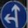
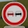
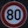

#**Traffic Sign Recognition** 

##Writeup Template

###You can use this file as a template for your writeup if you want to submit it as a markdown file, but feel free to use some other method and submit a pdf if you prefer.

---

**Build a Traffic Sign Recognition Project**

The goals / steps of this project are the following:
* Load the data set (see below for links to the project data set)
* Explore, summarize and visualize the data set
* Design, train and test a model architecture
* Use the model to make predictions on new images
* Analyze the softmax probabilities of the new images
* Summarize the results with a written report

[//]: # (Image References)

[image1]: ./examples/visualization.jpg "Visualization"
[image2]: ./examples/grayscale.jpg "Grayscaling"
[image3]: ./examples/random_noise.jpg "Random Noise" 
[image5]: ./examples/placeholder.png "Traffic Sign 2"
[image6]: ./examples/placeholder.png "Traffic Sign 3"
[image7]: ./examples/placeholder.png "Traffic Sign 4"
[image8]: ./examples/placeholder.png "Traffic Sign 5"

## Rubric Points
###Here I will consider the [rubric points](https://review.udacity.com/#!/rubrics/481/view) individually and describe how I addressed each point in my implementation.  

---
###Writeup / README

####1. Provide a Writeup / README that includes all the rubric points and how you addressed each one. You can submit your writeup as markdown or pdf. You can use this template as a guide for writing the report. The submission includes the project code.

You're reading it! and here is a link to my [project code](https://github.com/asunar/CarND-Traffic-Sign-Classifier-Project/blob/master/Traffic_Sign_Classifier.ipynb)

###Data Set Summary & Exploration

####1. Provide a basic summary of the data set and identify where in your code the summary was done. In the code, the analysis should be done using python, numpy and/or pandas methods rather than hardcoding results manually.

The code for this step is contained in the second code cell of the IPython notebook.  

I used python to calculate summary statistics of the traffic
signs data set:

* The size of training set is ? 34799
* The size of test set is ? 12630
* The shape of a traffic sign image is ? (32, 32, 3)
* The number of unique classes/labels in the data set is ? 43

####2. Include an exploratory visualization of the dataset and identify where the code is in your code file.

The code for this step is below the markdown cell that starts with Include an exploratory visualization...

The first cell displays a random image and class id. It is useful to get an idea of the training set.
In the following cell, there are few convenience methods to determine a sign and sign description based on the class id.
I have used the methods in this cell when trying to find traffic signs on the web.

###Design and Test a Model Architecture

####1. Describe how, and identify where in your code, you preprocessed the image data. What tecniques were chosen and why did you choose these techniques? Consider including images showing the output of each preprocessing technique. Pre-processing refers to techniques such as converting to grayscale, normalization, etc.

The code for this step is below the markdown cell that starts with Pre-process the Data Set...

The preprocessing steps initially included converting to grayscale and normalization. However, converting to grayscale lowered the validation accuracy of my model so I removed it in the subsequent stages.

I normalized the image data because it does not change the content of the image, it makes it easier for the optimization to proceed numerically.

As a last step, I shuffled the data to prevent the model from overfitting based on the order of the training set.

####2. Describe how, and identify where in your code, you set up training, validation and testing data. How much data was in each set? Explain what techniques were used to split the data into these sets. (OPTIONAL: As described in the "Stand Out Suggestions" part of the rubric, if you generated additional data for training, describe why you decided to generate additional data, how you generated the data, identify where in your code, and provide example images of the additional data)

Downloaded dataset already was already split into train, test and validate files, so I did not have to do and slicing.

My final training set had 34799 number of images. My validation set and test set had 4410 and 12630 number of images.

I did not augment the dataset. Generating and augmenting data to end up with a more balanced distribution of signs is something I will look into as I review this project i.e. if there are only few images of certain signs, I can create slightly modified copies of these signs to feed more of these signs to the model to improve accuracy.

My main strategy was to tune the hyper parameters to get a good enough accuracy.

####3. Describe, and identify where in your code, what your final model architecture looks like including model type, layers, layer sizes, connectivity, etc.) Consider including a diagram and/or table describing the final model.

The code for my final model is located in the seventh cell of the ipython notebook. 

My final model consisted of the following layers:

| Layer         		|     Description	        					| 
|:---------------------:|:---------------------------------------------:| 
| Input         		| 32x32x3 RGB image   							| 
| Convolution 1x1		| 1x1 stride, valid padding, outputs 28x28x6	|
| RELU					|												|
| Max pooling	      	| 2x2 stride,  outputs 14x14x6					|
| Convolution 1x1		| 1x1 stride, valid padding, outputs 10x10x6	|
| RELU					|												|
| Max pooling	      	| 2x2 stride,  outputs 5x5x6					|
| Flatten				| Outputs 400									|
| Fully connected		| Outputs 120  									|
| RELU					|												|
| Fully connected		| Outputs 84  									|
| RELU					|												|
| Dropout				| Keep prob in training:0.5, test: 1.0			|
 Fully connected		| Outputs 10  									|

####4. Describe how, and identify where in your code, you trained your model. The discussion can include the type of optimizer, the batch size, number of epochs and any hyperparameters such as learning rate.

The code for training the model is located in the cell that begins with the comment #Train the model
To train the model, I simply added dropoout to the code that was used to train the LeNet model. I used keep_probability of 0.5 during training. The rest is pretty much the same, initialize variables, process batches by batch_size in a loop epoch count times, print out the accuracy of each iteration and save the model.

####5. Describe the approach taken for finding a solution. Include in the discussion the results on the training, validation and test sets and where in the code these were calculated. Your approach may have been an iterative process, in which case, outline the steps you took to get to the final solution and why you chose those steps. Perhaps your solution involved an already well known implementation or architecture. In this case, discuss why you think the architecture is suitable for the current problem.

The code for calculating the accuracy of the model is located in the ninth cell of the Ipython notebook.

My final model results were:
* training set accuracy of ? 0.999
* validation set accuracy of ? 0.953
* test set accuracy of ? 0.936

If a well known architecture was chosen:
* What architecture was chosen?
* Why did you believe it would be relevant to the traffic sign application?
Started with the LeNet architecture. I think it was relevant because both problems were related to image recognition. 

* How does the final model's accuracy on the training, validation and test set provide evidence that the model is working well?
Training, validation and test set accuracies over 93% with just 20 epochs provide evidence that model is fairly good at classifying images in a new set. Normalizing the images, adding a dropout layer to the LeNet architecture along with tuning the hyperparameters (learning rate, standard deviation, batch size) helped improve the validation accuracy.
 

###Test a Model on New Images

####1. Choose five German traffic signs found on the web and provide them in the report. For each image, discuss what quality or qualities might be difficult to classify.

Here are five German traffic signs that I found on the web:
 

The first image might be difficult to classify because the bottom of the sign is cropped out so model may not have been able to detect circle in the image. All of the go straight or left signs I looked in the training set include the circle which contains the actual sign.

This was an interesting mistake on my part so I decided to leave it in. I simply labeled the image wrong; the last image is for speed limit 80km. I accidentally labeled the image as end of speed limit 80km. Another example of the simplest explanation is probably the correct one. I should have double checked the labeling before diving into code to figure out what was going wrong.

####2. Discuss the model's predictions on these new traffic signs and compare the results to predicting on the test set. Identify where in your code predictions were made. At a minimum, discuss what the predictions were, the accuracy on these new predictions, and compare the accuracy to the accuracy on the test set (OPTIONAL: Discuss the results in more detail as described in the "Stand Out Suggestions" part of the rubric).

The code for making predictions on my final model is located in the cell that is below the title Predict the Sign Type for Each Image

Here are the results of the prediction:

| Image			        |     Prediction	        					| 
|:---------------------:|:---------------------------------------------:| 
| Go straight or left      		|  	Roundabout mandatory   									| 
| Keep left     			| Keep left 										|
| No entry					| No entry											|
| No passing	      		| No passing					 				|
| Speed limit 80 km/h			| Speed limit (30km/h)      							|

The model was able to correctly guess 3 of the 5 traffic signs, which gives an accuracy of 60%. This compares favorably to the accuracy on the test set of 0.936

####3. Describe how certain the model is when predicting on each of the five new images by looking at the softmax probabilities for each prediction and identify where in your code softmax probabilities were outputted. Provide the top 5 softmax probabilities for each image along with the sign type of each probability. (OPTIONAL: as described in the "Stand Out Suggestions" part of the rubric, visualizations can also be provided such as bar charts)

The code for making predictions on my final model is located in the cell that starts with Print out the top five softmax...

Please see the probability/prediction table in the notebook.

For the first image, the model is relatively sure that this is a stop sign (probability of 0.6), and the image does contain a stop sign. The top five soft max probabilities were

| Probability         	|     Prediction	        					| 
|:---------------------:|:---------------------------------------------:| 
| .60         			| Stop sign   									| 
| .20     				| U-turn 										|
| .05					| Yield											|
| .04	      			| Bumpy Road					 				|
| .01				    | Slippery Road      							|

For the second image ... 
